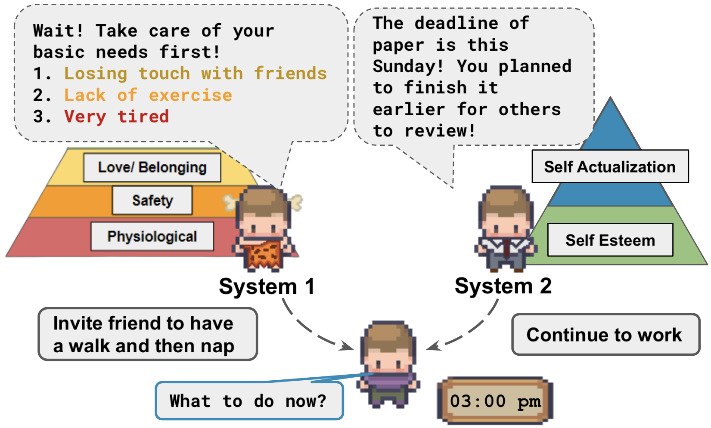
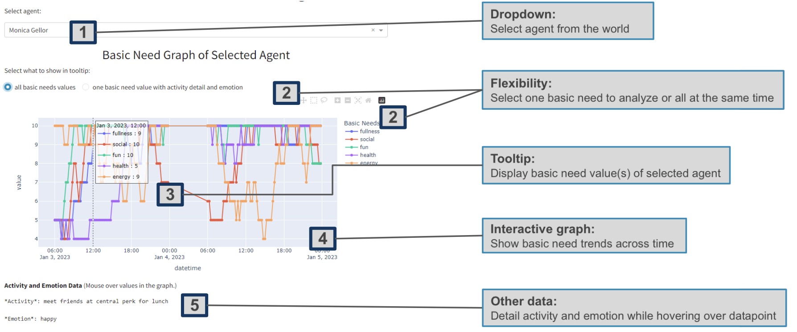

## What is Humanoid Agents?

[Paper](https://arxiv.org/abs/2310.05418) | [Demo](https://www.humanoidagents.com/) | [YouTube Walkthrough (2m)](https://youtu.be/vQkOf-zS2Y0)

Humanoid agents is a platform for building agents inspired by how humans think, talk and behave. Humanoid Agents does by complementing System 2 logical thinking with System 1 thinking based on embodied conditions such as the fulfilment of their basic needs, emotions and their relationships with others. 

*We are happy to announce that Humanoid Agents has been accepted to __EMNLP System Demonstrations 2023__!*




## Contents

- [What is Humanoid Agents?](#what-is-humanoid-agents)
- [Contents](#contents)
- [Installation](#installation)
- [Get Started](#get-started)
- [Customizing locations and specific agents](#customizing-locations-and-specific-agents)
- [Analytics Dashboard](#analytics-dashboard)
- [Unity WebGL Game interface](#unity-webgl-game-interface)
- [How does Humanoid Agents work?](#how-does-humanoid-agents-work)
- [(Optional) Adding new basic needs](#optional-adding-new-basic-needs)
- [(Optional/Advanced) Extending HumanoidAgent class](#optionaladvanced-extending-humanoidagent-class)
- [Future Plans](#future-plans)
- [Citation](#citation)


## Installation

```
git clone https://github.com/HumanoidAgents/HumanoidAgents.git
cd HumanoidAgents
pip install -e .
```


## Get Started

Run a simulation like this:

```
cd humanoidagents
python run_simulation.py --output_folder_name ../generations/big_bang_theory \
--map_filename ../locations/big_bang_map.yaml \
--agent_filenames ../specific_agents/sheldon_cooper.json ../specific_agents/leonard_hofstadter.json ../specific_agents/penny.json
```

Windows users: avoid using "\\" in command

Prerequisites

1. ```export OPENAI_API_KEY=sk-...``` to use your OpenAI Key (only if you would like to use OpenAI LLM; otherwise please select ```--llm local``` to run local inferencing models instead). Please be careful not to exceed your quota since every simulated day with 2 to 3 agents cost around $2-5 and takes 45-60 minutes given the number of API calls. For **Windows** users, this should be ```set OPENAI_API_KEY=sk-...```

Required arguments

1. ```--output_folder_name``` refers to the folder where the generated output will be stored
2. ```--map_filename``` refers to the filename of the map used (see section below for list of built in maps)
3. ```--agent_filenames``` refers to the list of agent specifications (see section below for list of built in agents)

Optional arguments

1. ```--default_agent_config_filename``` refers to the default agent config file where we define the types of basic needs that every agent has. For more details, refer to the section below.

2. ```--start_date``` refers to the (inclusive) start date of the interested date range. The format is YYYY-MM-DD e.g. 2023-01-03. Kindly note that the date should not be earlier than 2023-01-03 since we use 2023-01-02 as the global_start_date for user-defined memories. If that is required, please adjust the global start date in code.

3. ```--end_date``` refers to the (inclusive) end date  of the interested date range. The format is YYYY-MM-DD e.g. 2023-01-04
   
4. ```--condition``` as noted in the paper, we can adjust the starting condition of all agents (in terms of their basic needs, emotion and closeness to others). You can use this to specify a condition (e.g. health) for all agents to be 0. See the list of accepted arguments on argparse

5. (NEW) ```--llm```  refers to the Large Language Model you would to use. Choose between ```openai``` for ChatGPT-3.5-turbo for LLM and Ada-v2 for embedding respectively and ```local``` (default) for a locally hosted LLM (such as Mistral 7B, Mixtral or any LlaMA models) and a local embedding model (such as sentence-transformers/all-MiniLM-L6-v2). Please note that the openai option charges to yout OpenAI account. For ```local```, you would also need to start a OpenAI-compatible server. There are many ways to do this but we recommend [LM Studio](https://lmstudio.ai/), a no-code solution equipped with a GUI, as a first attempt to do this.

## Customizing locations and specific agents

Currently, we support three built-in settings

1. **Big Bang Theory** ```--map_filename ../locations/big_bang_map.yaml \
--agent_filenames ../specific_agents/sheldon_cooper.json ../specific_agents/leonard_hofstadter.json ../specific_agents/penny.json```

2. **Friends** ```--map_filename ../locations/friends_map.yaml \
--agent_filenames ../specific_agents/joey_tribbiani.json ../specific_agents/monica_gellor.json ../specific_agents/rachel_greene.json```

3. **Lin Family** ```--map_filename ../locations/lin_family_map.yaml \
--agent_filenames ../specific_agents/eddy_lin.json ../specific_agents/john_lin.json```

To create your own setting, you can create your own map as well as your own specific agents. The fields you need to fill for each can be learned from looking at the examples. 

One thing to know is that agents and map are not completely decoupled. For every agent_filename you specify, the name field of the agent has to be contained in the map.yaml under Agents as a key. This sets the initial location of the agent on the map. 

## Analytics Dashboard



The generated data can be visualized by a interactive dashboard. You can select the agent in the world to visualize their status. 

It consists of the graph of basic needs and the graph of social relationship with the corresponding information including the emotion, conversation details.

To run the dashboard, run the following
```
cd humanoidagents
python run_dashboard.py --folder <folder/containing/generation/output/from/run_simulation.py> 
```

Required arguments

1. ```--folder``` refers to the folder where the generated output have be stored from run_simulation.py
2. ```--mode``` refers to the method of selecting data from the folder. It has two modes: 1) ```all```: visualizing all files in the folder 2) ```date_range```: visualizing files with interested date range (need to state the date range in arguments)

Optional arguments
1. ```--start_date``` refers to the (inclusive) start date  of the interested date range when ```--mode = date_range```. The format is YYYY-MM-DD e.g. 2023-01-03
2. ```--end_date``` refers to the (inclusive) end date  of the interested date range when ```--mode = date_range```. The format is YYYY-MM-DD e.g. 2023-01-04


## Unity WebGL Game interface

The Game Interface using Unity WebGL is available on [humanoidagents.com](https://www.humanoidagents.com/)

Support for customized locations and agents is coming soon!

See a 2 minute YouTube Walkthrough below. 

[](https://www.youtube.com/watch?v=vQkOf-zS2Y0)

## How does Humanoid Agents work?


**Step 1.** Agent is initialized based on user-provided seed information. 
**Step 2.** Agent plans their day.  
**Step 3.** Agent takes an action based on their plan. 
**Step 4.** Agent evaluates if action taken changes their basic needs status and emotion. 
**Step 5.** Agent can update their future plan based on the satisfaction of their basic needs and emotion. 
**Step 3a.** Agent can converse with another agent if in the same location, which can affect the closeness of their relationship.
    

## (Optional) Adding new basic needs

You might also be interested to add/remove further basic needs to agents other than the five we have as a default (fullness, social, health, fun and energy)

To do that, you can create your own default_agent_config.json file.

Each basic need requires the following format in order for the code to support them.

```json
{
    "name": "fullness", 
    "start_value": 5, 
    "unsatisfied_adjective": "hungry", 
    "action": "eating food", 
    "decline_likelihood_per_time_step": 0.05, 
    "help": "from 0 to 10, 0 is most hungry; increases or decreases by 1 at each time step based on activity"
}
```

## (Optional/Advanced) Extending HumanoidAgent class

If you're reading this, you have played around with the code and now you're ready to take it to the next level.

Instead of using our code, you want to extend it to support more aspects for an Agent such as personality, empathy, moral values or whatever aspect you're interested in.

We provide an abstract interface at ```customized_humanoid_agent.py``` to demonstrate the main functions you have to override to modify the behavior of the agent.

You don't have to modify every method (if you don't and don't want the NotImplementedError to be raised, please remove the function altogether). Instead, simply modify whichever method you need and the others will inherit from ```HumanoidAgent```.

## Future Plans

- [ ] Support customized map and agents on Game Interface
- [ ] Support other LLMs
- [ ] Support other aspects of System 1 thinking

## Citation

```bibtex
@misc{wang2023humanoid,
      title={Humanoid Agents: Platform for Simulating Human-like Generative Agents}, 
      author={Zhilin Wang and Yu Ying Chiu and Yu Cheung Chiu},
      year={2023},
      eprint={2310.05418},
      archivePrefix={arXiv},
      primaryClass={cs.CL}
}
```

